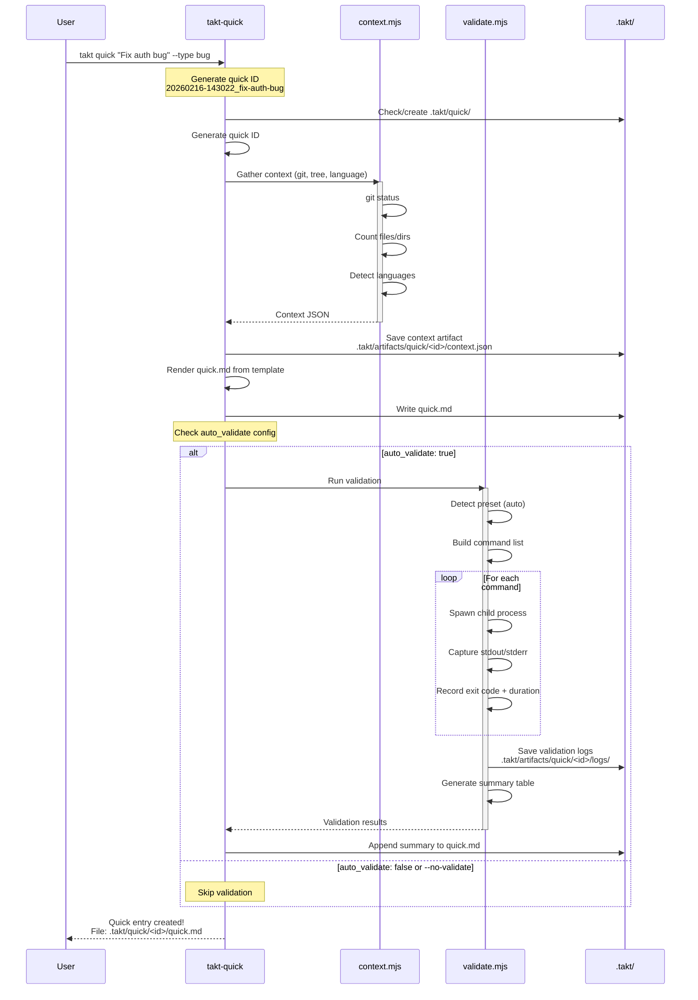
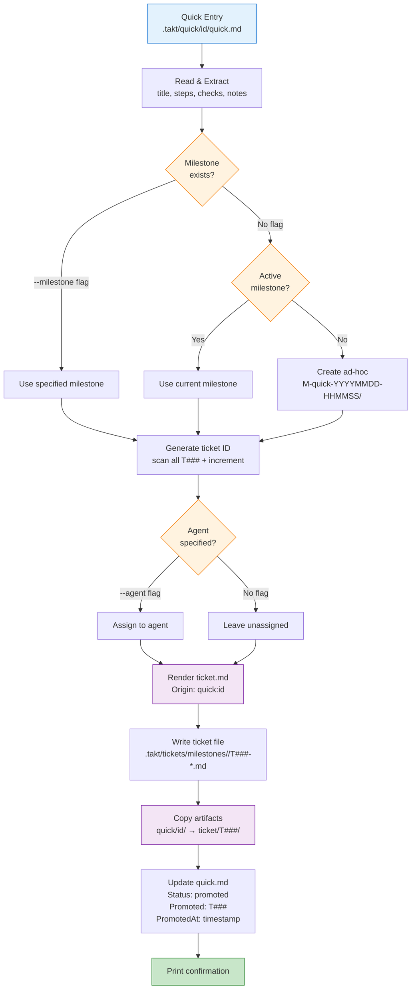
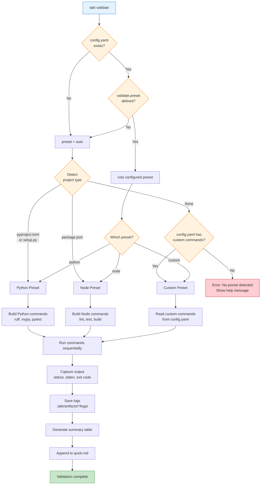
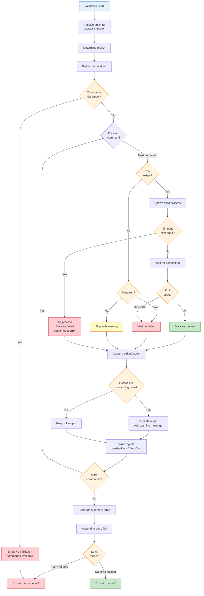
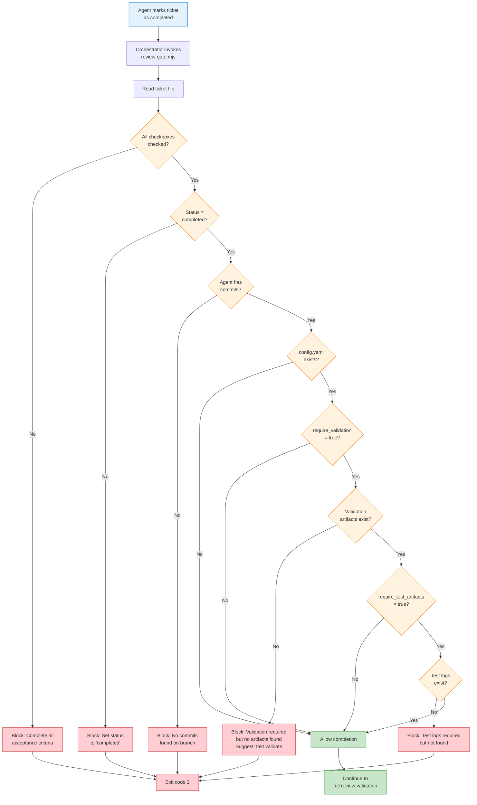
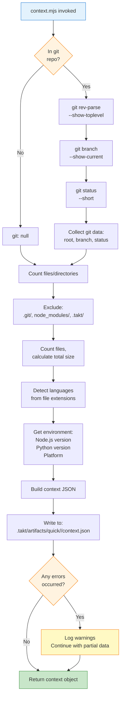
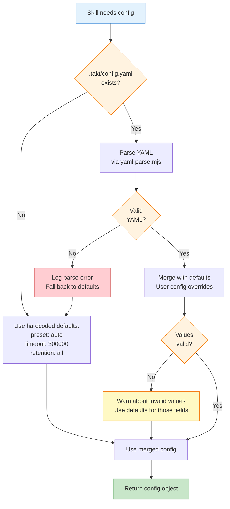
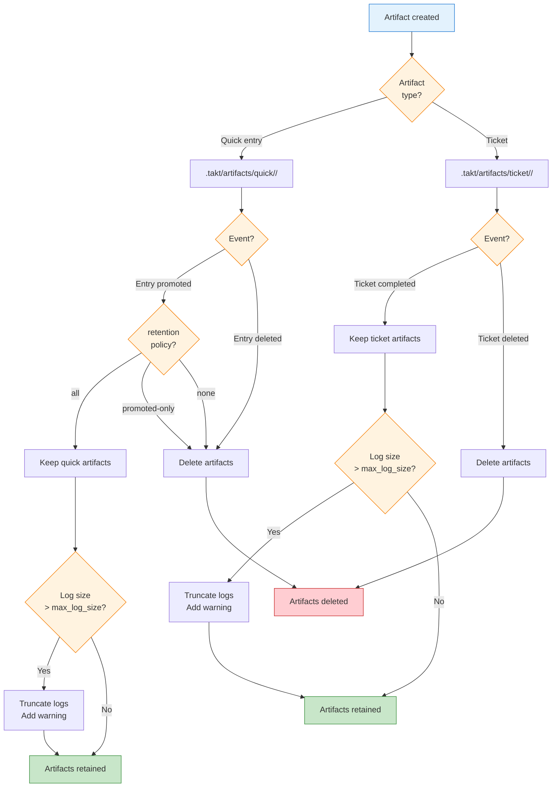

# Takt Quick Mode + Validation — Diagrams

**Version:** 0.3.0
**Date:** 2026-02-16

This document contains visual diagrams for Quick Mode and Validation features using Mermaid syntax.

---

## 1. Quick Mode Sequence Diagram

Shows the full flow from quick entry creation through validation.



---

## 2. Promote Flow Diagram

Shows the data transformation from quick entry to ticket.



---

## 3. Validation Preset Detection Flow

Shows how validation preset is auto-detected or configured.



---

## 4. Validation Execution Flow

Shows the detailed execution of validation commands with error handling.



---

## 5. Review Gate Integration Flow

Shows how review-gate.mjs checks for validation artifacts.



---

## 6. Complete Workflow: Quick to Ticket

Shows the full lifecycle from quick entry creation to ticket completion.

```mermaid
flowchart TD
    START[User needs to<br/>fix a bug] --> QUICK[takt quick<br/>"Fix auth timeout" --type fix]

    QUICK --> QMD[.takt/quick/<id>/quick.md<br/>created]

    QMD --> WORK[User edits code<br/>Updates quick.md progress]

    WORK --> VALIDATE[takt validate]
    VALIDATE --> VRESULTS[Validation results<br/>appended to quick.md]

    VRESULTS --> DECISION{Scope<br/>grew?}

    DECISION -->|No, done| DONE1[Mark quick.md as done<br/>Keep as historical record]
    DECISION -->|Yes| PROMOTE[takt promote<br/>--milestone M002-api]

    PROMOTE --> TICKET[Ticket created<br/>.takt/tickets/milestones/M002-api/T042-*.md]

    TICKET --> ARTIFACTS[Artifacts copied<br/>quick/<id>/ → ticket/T042/]

    ARTIFACTS --> QUPDATE[quick.md updated<br/>Status: promoted<br/>Promoted: T042]

    QUPDATE --> ASSIGN[Assign to agent<br/>takt-backend]

    ASSIGN --> EXECUTE[takt execute<br/>Agent starts work]

    EXECUTE --> AGENTWORK[Agent completes ticket<br/>Marks checkboxes<br/>Sets status: completed]

    AGENTWORK --> GATE[Review gate triggered]

    GATE --> GATECHECK{Validation<br/>artifacts?}

    GATECHECK -->|Missing| BLOCK[Blocked: Run validation]
    GATECHECK -->|Found| REVIEW[Full review<br/>Build + Test + Peer]

    BLOCK --> VALTICKET[takt validate T042]
    VALTICKET --> GATE

    REVIEW --> APPROVE{Review<br/>passed?}

    APPROVE -->|No| FIXES[Agent fixes issues]
    APPROVE -->|Yes| MERGE[Merge agent branch<br/>to main]

    FIXES --> AGENTWORK

    MERGE --> ARCHIVE[Archive ticket<br/>to milestone archive]

    ARCHIVE --> DONE2[Milestone complete]

    style START fill:#e3f2fd,stroke:#1976d2
    style DONE1 fill:#c8e6c9,stroke:#388e3c
    style DONE2 fill:#c8e6c9,stroke:#388e3c
    style BLOCK fill:#ffcdd2,stroke:#c62828
    style DECISION fill:#fff3e0,stroke:#f57c00
    style GATECHECK fill:#fff3e0,stroke:#f57c00
    style APPROVE fill:#fff3e0,stroke:#f57c00
    style QUICK fill:#f3e5f5,stroke:#7b1fa2
    style PROMOTE fill:#f3e5f5,stroke:#7b1fa2
    style VALIDATE fill:#f3e5f5,stroke:#7b1fa2
    style VALTICKET fill:#f3e5f5,stroke:#7b1fa2
```

---

## 7. Context Gathering Process

Shows how context.mjs collects environment information.



---

## 8. Config.yaml Loading and Defaults

Shows how configuration is resolved with fallback to defaults.



---

## 9. Artifact Retention Flow

Shows how artifacts are managed based on retention policy.



---

## 10. Error Handling Decision Tree

Shows how errors are handled across different components.

```mermaid
flowchart TD
    ERROR[Error occurred] --> WHERE{Component?}

    WHERE -->|Quick entry creation| QERR{Error type?}
    WHERE -->|Validation| VERR{Error type?}
    WHERE -->|Promotion| PERR{Error type?}
    WHERE -->|Review gate| RERR{Error type?}

    QERR -->|.takt/ missing| QCREATE[Run init-project.mjs<br/>Create .takt/]
    QERR -->|Context gathering failed| QWARN[Warn user<br/>Create with partial context]
    QERR -->|Template render failed| QFATAL[Fatal error<br/>Don't create entry]

    VERR -->|No preset detected| VHELP[Show help message<br/>Suggest custom config]
    VERR -->|All commands skipped| VFATAL[Fatal error<br/>No validation possible]
    VERR -->|Command timeout| VLOG[Log timeout<br/>Mark as failed<br/>Continue]
    VERR -->|Tool not found| VSKIP[Skip with warning<br/>Continue if not required]

    PERR -->|Entry not found| PFATAL[Fatal error<br/>List available entries]
    PERR -->|Already promoted| PINFO[Show existing ticket<br/>Don't re-promote]
    PERR -->|Milestone missing| PCREATE[Create ad-hoc milestone]
    PERR -->|Agent missing| PWARN[Warn user<br/>Leave unassigned]

    RERR -->|Checkboxes unchecked| RBLOCK[Block with exit code 2<br/>List missing criteria]
    RERR -->|Status not completed| RBLOCK
    RERR -->|No commits| RBLOCK
    RERR -->|Validation missing| RBLOCK

    QCREATE --> RETRY1[Retry operation]
    QWARN --> CONT1[Continue]
    QFATAL --> EXIT1[Exit with error]

    VHELP --> EXIT2[Exit with error]
    VFATAL --> EXIT2
    VLOG --> CONT2[Continue]
    VSKIP --> CONT2

    PFATAL --> EXIT3[Exit with error]
    PINFO --> EXIT3
    PCREATE --> CONT3[Continue]
    PWARN --> CONT3

    RBLOCK --> EXIT4[Exit with code 2<br/>Block completion]

    style ERROR fill:#ffcdd2,stroke:#c62828
    style EXIT1 fill:#ffcdd2,stroke:#c62828
    style EXIT2 fill:#ffcdd2,stroke:#c62828
    style EXIT3 fill:#ffcdd2,stroke:#c62828
    style EXIT4 fill:#ffcdd2,stroke:#c62828
    style QFATAL fill:#ffcdd2,stroke:#c62828
    style VFATAL fill:#ffcdd2,stroke:#c62828
    style PFATAL fill:#ffcdd2,stroke:#c62828
    style PINFO fill:#ffcdd2,stroke:#c62828
    style RBLOCK fill:#ffcdd2,stroke:#c62828
    style QWARN fill:#fff9c4,stroke:#f57f17
    style VLOG fill:#fff9c4,stroke:#f57f17
    style VSKIP fill:#fff9c4,stroke:#f57f17
    style PWARN fill:#fff9c4,stroke:#f57f17
    style CONT1 fill:#c8e6c9,stroke:#388e3c
    style CONT2 fill:#c8e6c9,stroke:#388e3c
    style CONT3 fill:#c8e6c9,stroke:#388e3c
    style RETRY1 fill:#c8e6c9,stroke:#388e3c
    style QCREATE fill:#c8e6c9,stroke:#388e3c
    style PCREATE fill:#c8e6c9,stroke:#388e3c
    style WHERE fill:#fff3e0,stroke:#f57c00
    style QERR fill:#fff3e0,stroke:#f57c00
    style VERR fill:#fff3e0,stroke:#f57c00
    style PERR fill:#fff3e0,stroke:#f57c00
    style RERR fill:#fff3e0,stroke:#f57c00
```



---

**Last Updated:** 2026-02-16
**Contributors:** Takt Team

**Note:** These diagrams use Mermaid syntax and can be rendered in:
- GitHub markdown files
- GitLab markdown files
- Documentation sites (MkDocs, Docusaurus, etc.)
- VS Code with Mermaid extension
- Online viewers (mermaid.live)
