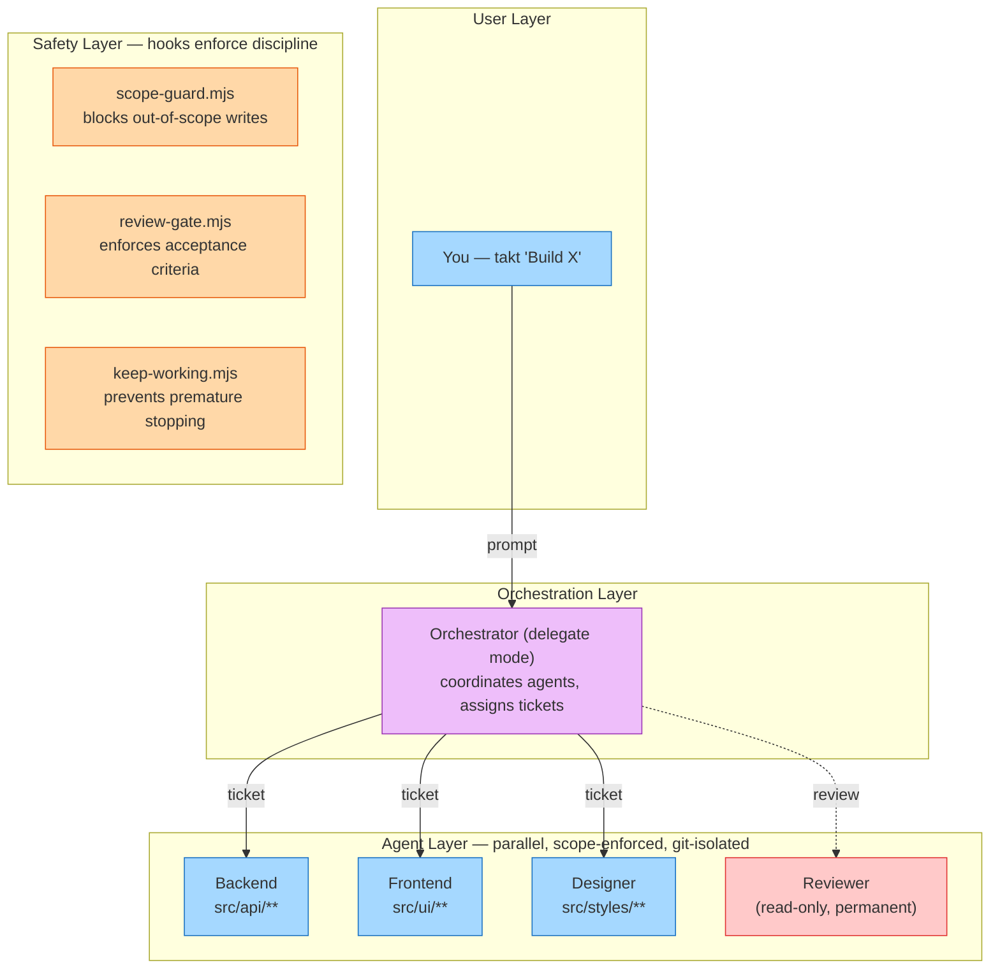

# Takt

**One prompt. A team of agents. Structured like a real engineering org.**

```
takt "Build a todo app with React and FastAPI"
```

Takt is a Claude Code plugin that spins up a team of scope-locked AI agents, assigns them tickets with dependencies, and runs them in parallel on isolated git branches — with mandatory code review on every merge.

**3 questions → auto-plan → approve → parallel execution → done.**

---

## What Makes Takt Different

Most multi-agent systems throw agents at a problem and hope for the best. Takt runs like an engineering team:

### Agents can't step on each other

Every agent has **enforced file boundaries**. The backend agent literally cannot write to frontend files — a PreToolUse hook blocks it before the write happens. No "oops, two agents edited the same file."

### Every agent gets its own git branch

Takt creates per-agent [git worktrees](https://git-scm.com/docs/git-worktree). Agents work in parallel on separate branches. At milestone end, branches merge back to main. Merge conflicts are near-impossible because scope enforcement prevents shared file access.

### Work is tracked in tickets, not vibes

Every task is a markdown ticket with acceptance criteria, dependencies, and an assigned agent. You can open `.takt/tickets/` and see exactly what's planned, in progress, and done — like a kanban board made of files.

### Mandatory code review on every ticket

A permanent opus-tier reviewer agent reviews every completed ticket for correctness, security, and quality before it can merge. The reviewer is read-only and cannot be removed.

### Everything is a readable file

No hidden state in LLM context. PRD, tech spec, tickets, decisions, progress — all markdown and JSON in `.takt/`. Stop the session, read the files, hand off to a colleague, resume a week later. `HANDOFF.md` alone captures the full project state.

### Stop and resume across sessions

`takt stop` saves everything. `takt resume` reads `HANDOFF.md`, reconstructs context, and picks up exactly where you left off — same milestone, same ticket, same agent assignments.

---

## Quick Start

```bash
# Install (session-only)
claude --plugin-dir /path/to/Takt

# Run
takt "Build a React dashboard with charts and user authentication"
```

Takt asks 3 questions, auto-generates the full plan, and waits for your approval:

```
Q1: Any hard constraints? (tech stack, existing code)
Q2: How should agents run? (Agent Teams / Subagents)
Q3: How involved do you want to be? (Autonomous / Checkpoints / Hands-on)

→ Plan generated. 4 agents, 17 tickets, 4 milestones. Approve?
```

Then agents execute in parallel:

```
[Takt] Executing M001 — Scaffolding (5 tickets, agent-teams mode)
[Takt] T001 approved (takt-backend)  — Setup FastAPI project structure
[Takt] T002 approved (takt-frontend) — Setup React + TypeScript scaffold
[Takt] T003 approved (takt-backend)  — Define shared API types
[Takt] T004 approved (takt-backend)  — Setup PostgreSQL schema
[Takt] T005 approved (takt-designer) — Setup design tokens
[Takt] Milestone M001 complete! 5/5 approved. Merging branches.
```

---

## How It Works

```
takt "Build X"
     │
     ├─ Phase 0: Planning ─── 3 questions → analyst + architect + planner auto-generate plan
     ├─ Phase 1: Agents ───── Dynamic agent roster from templates (+ mandatory orchestrator & reviewer)
     ├─ Phase 2: Tickets ──── Milestones with dependency-ordered tickets, acceptance criteria
     ├─ Phase 3: Execute ──── Parallel agents on git worktrees, scope-enforced, inline progress
     ├─ Phase 4: Review ───── Build + test + peer review (mandatory) + optional user review
     └─ Phase 5: Iterate ──── Archive milestone, merge branches, advance to next
```

### Architecture



### Execution Modes

| Mode | How It Works | Best For |
|------|-------------|----------|
| **Agent Teams** | Persistent teammates, shared task list, native messaging | Users with `CLAUDE_CODE_EXPERIMENTAL_AGENT_TEAMS=1` |
| **Subagents** | Task-tool parallel batch dispatch, file-based communication | Everyone — no experimental features needed |

---

## Commands

| Command | Slash Command | Description |
|---------|---------------|-------------|
| `takt <description>` | `/takt-plan` | Start a new project (plan + execute) |
| `takt status` | `/takt-status` | Show dashboard: agents, tickets, progress |
| `takt review` | `/takt-review` | Trigger review on completed tickets |
| `takt next` | `/takt-next` | Advance to the next milestone |
| `takt handoff` | `/takt-handoff` | Update HANDOFF.md with current state |
| `takt resume` | `/takt-resume` | Resume an interrupted session |
| `takt stop` | `/takt-stop` | Gracefully shut down and save state |
| `takt execute` | `/takt-execute` | Launch execution for current milestone |

---

## What Gets Generated

### Project State (`.takt/`)

```
.takt/
  HANDOFF.md              # THE context file — full project state in one place
  POLICY.md               # Shared rules all agents follow
  prd.md                  # Product requirements
  tech-spec.md            # Technical specification
  constraints.md          # Hard constraints
  session.json            # Config (execution mode, review mode, etc.)
  state/takt-state.json   # Phase, milestone, ticket counts
  agents/registry.json    # Agent roster with scoped paths
  tickets/
    milestones/M001-*/    # Active tickets (markdown with acceptance criteria)
    archive/M001-*/       # Completed milestones (tickets + outputs + reviews bundled)
  comms/decisions.md      # Architectural decisions log
  reviews/                # Review results (JSON)
  logs/                   # Summaries, errors, scope violations
```

### Agent Definitions (`.claude/agents/`)

```
takt-orchestrator.md      # Team lead — delegate mode, no code tools [permanent]
takt-reviewer.md          # Code reviewer — read-only, opus [permanent]
takt-backend.md           # Backend engineer (dynamic, per-project)
takt-frontend.md          # Frontend engineer (dynamic, per-project)
...                       # Additional specialists as needed
```

---

## Agent Templates

Takt ships 8 templates. The architect selects and customizes them per project.

| Template | Model | Role |
|----------|-------|------|
| **backend** | sonnet | APIs, database, server logic |
| **frontend** | sonnet | UI, state, routing, styling |
| **reviewer** | opus | Code review, quality gates (read-only, **permanent**) |
| **pm** | sonnet | Requirements, status reports |
| **designer** | sonnet | Design tokens, components, layouts |
| **researcher** | sonnet | API docs, library evaluation |
| **content** | haiku | User-facing copy, documentation |
| **devops** | sonnet | CI/CD, Docker, deployment |

**Mandatory agents** (always present, cannot be removed):
- **takt-orchestrator** — Coordinates all agents. Cannot write code.
- **takt-reviewer** — Reviews every completed ticket. Cannot be removed.

---

## Configuration

Set during planning via Question 3. Stored in `.takt/session.json`.

| Involvement Level | reviewMode | milestoneAdvanceMode | milestoneGranularity |
|-------------------|-----------|---------------------|---------------------|
| **Autonomous** | auto | auto-advance | coarse |
| **Milestone checkpoints** | auto | user-decides | medium |
| **Hands-on** | user | user-decides | fine |

| Setting | Values | Default |
|---------|--------|---------|
| `agentApprovalMode` | `auto` / `suggest` / `locked` | `suggest` |
| `reviewMode` | `auto` / `peer` / `user` | `auto` |
| `milestoneAdvanceMode` | `auto-advance` / `re-plan` / `user-decides` | `user-decides` |

---

## Multi-Feature Support

Already used Takt in this repo? Just run it again:

```
takt "Add notification system with email and push"
```

Takt detects the existing project and asks:
- **Extend** — adds milestones to the current feature (continues numbering)
- **New feature** — archives completed work, keeps agents and tech spec, plans fresh

---

## Safety Layer

Three hooks enforce team discipline:

| Hook | What It Does |
|------|-------------|
| **scope-guard.mjs** | Blocks writes outside agent's owned paths (both modes) |
| **review-gate.mjs** | Enforces acceptance criteria before ticket completion (Agent Teams) |
| **keep-working.mjs** | Redirects idle agents to their next ticket (Agent Teams) |

---

## Requirements

| | |
|---|---|
| **Claude Code** | Latest version |
| **Node.js** | >= 18.0.0 |
| **Git** | Required for worktree isolation |
| **Agent Teams** *(optional)* | `CLAUDE_CODE_EXPERIMENTAL_AGENT_TEAMS=1` for persistent teammate mode |
| **Dependencies** | None. Zero. Just the plugin. |

---

## Troubleshooting

**Plugin not loading?** Check `claude --plugin-dir /path/to/Takt` points to the right directory.

**Agent Teams not working?** Set `export CLAUDE_CODE_EXPERIMENTAL_AGENT_TEAMS=1`, or switch to Subagent mode in `.takt/session.json`.

**Scope violations?** Check `.takt/agents/registry.json` for glob patterns.

**Resume after interruption?** `takt resume` reads HANDOFF.md and picks up where you left off.

---

## Contributing

1. Read `CLAUDE.md` (developer guide) and `STATUS.md` (project status)
2. All scripts: ESM (`.mjs`), zero external dependencies, Node.js built-ins only
3. Use `${CLAUDE_PLUGIN_ROOT}` for portable paths, `{{PLACEHOLDER}}` in templates
4. Test in a separate project: `mkdir /tmp/test && cd /tmp/test && git init && claude --plugin-dir /path/to/Takt`

---

## License

MIT License. See [LICENSE](LICENSE).

---

**Takt v0.2.0** — Agent orchestration meets ticket-based workflows. Zero dependencies. 3 questions to autonomous execution.
