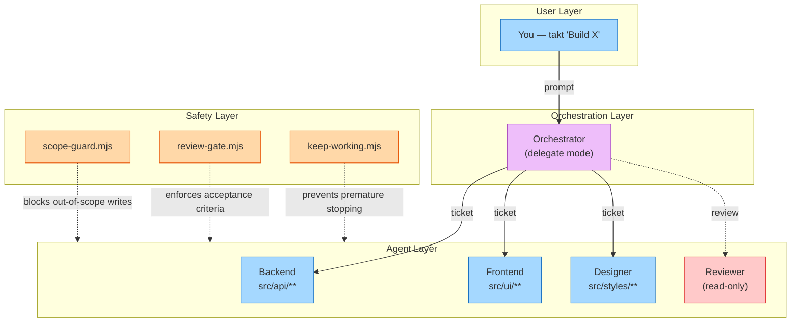

# Takt

**One prompt. A team of agents. Structured like a real engineering org.**

```
takt "Build a todo app with React and FastAPI"
```

Takt is a Claude Code plugin that spins up a team of scope-locked AI agents, assigns them tickets with dependencies, and runs them in parallel on isolated git branches — with mandatory code review on every merge.

**3 questions → auto-plan → approve → parallel execution → done.**

---

## What Makes Takt Different

Most multi-agent systems throw agents at a problem and hope for the best. Takt runs like an engineering team:

### Agents can't step on each other

Every agent has **enforced file boundaries**. The backend agent literally cannot write to frontend files — a PreToolUse hook blocks it before the write happens. No "oops, two agents edited the same file."

### Every agent gets its own git branch

Takt creates per-agent [git worktrees](https://git-scm.com/docs/git-worktree). Agents work in parallel on separate branches. At milestone end, branches merge back to main. Merge conflicts are near-impossible because scope enforcement prevents shared file access.

### Work is tracked in tickets, not vibes

Every task is a markdown ticket with acceptance criteria, dependencies, and an assigned agent. You can open `.takt/tickets/` and see exactly what's planned, in progress, and done — like a kanban board made of files.

### Mandatory code review on every ticket

A permanent opus-tier reviewer agent reviews every completed ticket for correctness, security, and quality before it can merge. The reviewer is read-only and cannot be removed.

### Everything is a readable file

No hidden state in LLM context. PRD, tech spec, tickets, decisions, progress — all markdown and JSON in `.takt/`. Stop the session, read the files, hand off to a colleague, resume a week later. `HANDOFF.md` alone captures the full project state.

### Stop and resume across sessions

`takt stop` saves everything. `takt resume` reads `HANDOFF.md`, reconstructs context, and picks up exactly where you left off — same milestone, same ticket, same agent assignments.

---

## Installation

### Option A: Plugin Marketplace (recommended)

Inside Claude Code, add the Takt marketplace and install the plugin:

```
/plugin marketplace add byseon/Takt
/plugin install takt@byseon-Takt
```

That's it. Takt is now available in all your projects.

### Option B: Clone and load

```bash
git clone https://github.com/byseon/Takt.git ~/takt
claude --plugin-dir ~/takt
```

To make it permanent without using the marketplace, add to your project's `.claude/settings.local.json`:

```json
{
  "pluginDirs": ["/absolute/path/to/takt"]
}
```

### Setting up Agent Teams mode (recommended)

Agent Teams mode gives each agent its own persistent process with native messaging. Agents appear as visible tmux panes so you can watch them work side-by-side in real time.

**Prerequisites:**

```bash
# 1. Install tmux
brew install tmux          # macOS
sudo apt install tmux      # Linux

# 2. Enable the Agent Teams experimental flag
#    Add to your shell profile (~/.zshrc or ~/.bashrc):
export CLAUDE_CODE_EXPERIMENTAL_AGENT_TEAMS=1
```

**Usage:**

```bash
# Always launch Claude Code inside a tmux session
tmux new -s myproject
claude
```

> **Why tmux?** Agent Teams spawns each agent as a separate Claude Code process. tmux lets you see all agents working side-by-side in split panes. Without tmux, agents still work but you lose visibility into their real-time progress.

> **Don't want to use tmux?** That's fine. During planning, choose **Subagent mode** instead — agents run via the Task tool in the background. No tmux required. You'll be asked which mode to use.

---

## Quick Start

```bash
# Navigate to your project
cd my-project

# Run
takt "Build a React dashboard with charts and user authentication"
```

Takt asks 3 questions, auto-generates the full plan, and waits for your approval:

```
Q1: Any hard constraints? (tech stack, existing code)
Q2: How should agents run? (Agent Teams / Subagents)
Q3: How involved do you want to be? (Autonomous / Checkpoints / Hands-on)

→ Plan generated. 4 agents, 17 tickets, 4 milestones. Approve?
```

Then agents execute in parallel:

```
[Takt] Executing M001 — Scaffolding (5 tickets, agent-teams mode)
[Takt] T001 approved (takt-backend)  — Setup FastAPI project structure
[Takt] T002 approved (takt-frontend) — Setup React + TypeScript scaffold
[Takt] T003 approved (takt-backend)  — Define shared API types
[Takt] T004 approved (takt-backend)  — Setup PostgreSQL schema
[Takt] T005 approved (takt-designer) — Setup design tokens
[Takt] Milestone M001 complete! 5/5 approved. Merging branches.
```

---

## Quick Mode

Not every task needs a full agent team. For bug fixes, small features, and research spikes, use quick mode:

```
takt quick "Fix auth token refresh" --type bug --scope src/auth/
```

Quick mode creates a lightweight tracked entry — no agents, no planning, no milestones:

```
.takt/quick/20260216-143022_fix-auth-token-refresh/
  quick.md          # Your task: context, steps, acceptance checks
```

### Validation

Run project checks (lint, typecheck, tests) with auto-detected presets:

```
takt validate
```

Results are saved as artifacts and appended to your quick entry.

### Promote to Ticket

When a quick task grows beyond a single session, promote it to a structured ticket:

```
takt promote 20260216-143022_fix-auth-token-refresh --to ticket
```

This carries over your context, acceptance checks, notes, and validation artifacts into a full ticket — ready for agent assignment.

---

## How It Works

```
takt "Build X"
     │
     ├─ Phase 0: Planning ─── 3 questions → analyst + architect + planner auto-generate plan
     ├─ Phase 1: Agents ───── Dynamic agent roster from templates (+ mandatory orchestrator & reviewer)
     ├─ Phase 2: Tickets ──── Milestones with dependency-ordered tickets, acceptance criteria
     ├─ Phase 3: Execute ──── Parallel agents on git worktrees, scope-enforced, inline progress
     ├─ Phase 4: Review ───── Build + test + peer review (mandatory) + optional user review
     └─ Phase 5: Iterate ──── Archive milestone, merge branches, advance to next
```

### Architecture



### Execution Modes

| Mode | How It Works | Best For |
|------|-------------|----------|
| **Agent Teams** | Persistent teammates, shared task list, native messaging | Users with `CLAUDE_CODE_EXPERIMENTAL_AGENT_TEAMS=1` |
| **Subagents** | Task-tool parallel batch dispatch, file-based communication | Everyone — no experimental features needed |

---

## Commands

| Command | Slash Command | Description |
|---------|---------------|-------------|
| `takt <description>` | `/takt-plan` | Start a new project (plan + execute) |
| `takt status` | `/takt-status` | Show dashboard: agents, tickets, progress |
| `takt review` | `/takt-review` | Trigger review on completed tickets |
| `takt next` | `/takt-next` | Advance to the next milestone |
| `takt handoff` | `/takt-handoff` | Update HANDOFF.md with current state |
| `takt resume` | `/takt-resume` | Resume an interrupted session |
| `takt stop` | `/takt-stop` | Gracefully shut down and save state |
| `takt execute` | `/takt-execute` | Launch execution for current milestone |
| `takt quick "<title>"` | `/takt-quick` | Quick single-task entry (no agents) |
| `takt validate` | `/takt-validate` | Run validation checks, save artifacts |
| `takt promote <id>` | `/takt-promote` | Promote quick entry to structured ticket |

---

## What Gets Generated

### Project State (`.takt/`)

```
.takt/
  HANDOFF.md              # THE context file — full project state in one place
  POLICY.md               # Shared rules all agents follow
  prd.md                  # Product requirements
  tech-spec.md            # Technical specification
  constraints.md          # Hard constraints
  session.json            # Config (execution mode, review mode, etc.)
  state/takt-state.json   # Phase, milestone, ticket counts
  agents/registry.json    # Agent roster with scoped paths
  tickets/
    milestones/M001-*/    # Active tickets (T{ID}-{agent}-{title}.md)
    archive/M001-*/       # Completed milestones (tickets + outputs + reviews bundled)
  comms/decisions.md      # Architectural decisions log
  reviews/                # Review results (JSON)
  logs/                   # Summaries, errors, scope violations
```

### Agent Definitions (`.claude/agents/`)

```
takt-orchestrator.md      # Team lead — delegate mode, no code tools [permanent]
takt-reviewer.md          # Code reviewer — read-only, opus [permanent]
takt-backend.md           # Backend engineer (dynamic, per-project)
takt-frontend.md          # Frontend engineer (dynamic, per-project)
...                       # Additional specialists as needed
```

---

## Agent Templates

Takt ships 7 templates. The architect selects and customizes them per project.

| Template | Model | Role |
|----------|-------|------|
| **backend** | sonnet | APIs, database, server logic |
| **frontend** | sonnet | UI, state, routing, styling |
| **reviewer** | opus | Code review, quality gates (read-only, **permanent**) |
| **designer** | sonnet | Design tokens, components, layouts |
| **researcher** | sonnet | API docs, library evaluation |
| **content** | haiku | User-facing copy, documentation |
| **devops** | sonnet | CI/CD, Docker, deployment |

**Mandatory agents** (always present, cannot be removed):
- **takt-orchestrator** — Coordinates all agents. Cannot write code.
- **takt-reviewer** — Reviews every completed ticket. Cannot be removed.

---

## Configuration

Set during planning via Question 3. Stored in `.takt/session.json`.

| Involvement Level | reviewMode | milestoneAdvanceMode | milestoneGranularity |
|-------------------|-----------|---------------------|---------------------|
| **Autonomous** | auto | auto-advance | coarse |
| **Milestone checkpoints** | auto | user-decides | medium |
| **Hands-on** | user | user-decides | fine |

| Setting | Values | Default |
|---------|--------|---------|
| `agentApprovalMode` | `auto` / `suggest` / `locked` | `suggest` |
| `reviewMode` | `auto` / `peer` / `user` | `auto` |
| `milestoneAdvanceMode` | `auto-advance` / `re-plan` / `user-decides` | `user-decides` |

---

## Multi-Feature Support

Already used Takt in this repo? Just run it again:

```
takt "Add notification system with email and push"
```

Takt detects the existing project and asks:
- **Extend** — adds milestones to the current feature (continues numbering)
- **New feature** — archives completed work, keeps agents and tech spec, plans fresh

---

## Safety Layer

Three hooks enforce team discipline:

| Hook | What It Does |
|------|-------------|
| **scope-guard.mjs** | Blocks writes outside agent's owned paths (both modes) |
| **review-gate.mjs** | Enforces acceptance criteria before ticket completion (Agent Teams) |
| **keep-working.mjs** | Redirects idle agents to their next ticket (Agent Teams) |

---

## Requirements

| | |
|---|---|
| **Claude Code** | Latest version (>= 1.0.33 for marketplace install) |
| **Node.js** | >= 18.0.0 |
| **Git** | Required for worktree isolation |
| **tmux** *(for Agent Teams)* | Agents spawn as visible tmux panes — `brew install tmux` or `apt install tmux` |
| **Agent Teams** *(optional)* | `CLAUDE_CODE_EXPERIMENTAL_AGENT_TEAMS=1` for persistent teammate mode |
| **Dependencies** | None. Zero. Just the plugin. |

---

## Troubleshooting

**Plugin not loading?** Run `/plugin` and check the **Errors** tab. If installed via clone, verify the path in `--plugin-dir` or `pluginDirs` setting.

**Marketplace install fails?** Make sure you're on Claude Code >= 1.0.33. Try `/plugin marketplace update byseon-Takt` to refresh.

**Agent Teams not working?** Check three things: (1) `echo $CLAUDE_CODE_EXPERIMENTAL_AGENT_TEAMS` should print `1`, (2) you're inside a tmux session (`tmux ls` should show your session), (3) if neither helps, switch to Subagent mode during planning.

**Agents not visible in tmux?** Make sure you launched `claude` inside `tmux new -s myproject`, not the other way around.

**Scope violations?** Check `.takt/agents/registry.json` for glob patterns. The scope-guard hook logs violations to stderr.

**Resume after interruption?** `takt resume` reads HANDOFF.md and picks up where you left off.

---

## Contributing

1. Read `CLAUDE.md` (developer guide) and `STATUS.md` (project status)
2. All scripts: ESM (`.mjs`), zero external dependencies, Node.js built-ins only
3. Use `${CLAUDE_PLUGIN_ROOT}` for portable paths, `{{PLACEHOLDER}}` in templates
4. Test in a separate project: `mkdir /tmp/test && cd /tmp/test && git init && claude --plugin-dir /path/to/takt`

---

## License

MIT License. See [LICENSE](LICENSE).

---

**Takt v0.3.0** — Agent orchestration meets ticket-based workflows. Zero dependencies. 3 questions to autonomous execution.
